# Rust Programming Language - Learning Documentation

> เอกสารสรุปการเรียนรู้ภาษา Rust ประกอบด้วย concepts และ examples จากการทำงานต่างๆ
> 
> **แหล่งอ้างอิง:** 
> - [Rust Programming Language](https://doc.rust-lang.org/)
> - [Pair programming with gemini](https://gemini.google.com/share/700487f0de41)

## 📚 Table of Contents

- [1. Basic Concepts](#1-basic-concepts)
- [2. Lifetime & Borrowing](#2-lifetime--borrowing)
- [3. Concurrency & Threading](#3-concurrency--threading)
- [4. HTTP Server Implementation](#4-http-server-implementation)
- [5. Smart Pointers](#5-smart-pointers)
- [6. Rust-Node.js Binding (NAPI)](#6-rust-nodejs-binding-napi)
- [7. Key Learning Highlights](#7-key-learning-highlights)

---

## 1. Basic Concepts
> **Location:** `basic/`
> **Entry Point:** `src/main.rs`, `src/lib.rs`

### 1.1 หลักการพื้นฐาน
โปรเจค basic นี้ครอบคลุม fundamental concepts ของ Rust ที่แต่ละโปรแกรมเมอร์ต้องเข้าใจ:

#### 📊 Data Types & Variables (ชนิดข้อมูลและตัวแปร)
**เหตุผลที่ Rust ต้องระบุชนิดข้อมูล:** Rust ใช้ static typing เพื่อป้องกันข้อผิดพลาดและเพิ่มประสิทธิภาพ

```rust
// Integer types - เลขจำนวนเต็ม
let a = 6_i16;           // i16 = signed 16-bit (-32,768 to 32,767)
let b: u32 = 20000;      // u32 = unsigned 32-bit (0 to 4,294,967,295)
let c = 2_000_000u64;    // underscore ช่วยให้อ่านง่าย

// Boolean & Character
let t = true;            // bool เก็บได้แค่ true/false
let heart_eyed_cat = '😻'; // char เก็บ Unicode 4 bytes

// Compound Types - ชนิดข้อมูลผสม
let tup: (i32, f64, u8) = (500, 6.4, 1);  // Tuple: ขนาดคงที่
let arr: [i32; 5] = [1, 2, 3, 4, 5];      // Array: ขนาดคงที่, ชนิดเดียว
```

#### 🔐 Ownership & Borrowing (กรรมสิทธิ์และการยืม)
**หลักการสำคัญ:** Rust ใช้ ownership system แทน garbage collector เพื่อจัดการ memory ได้อย่างปลอดภัยและมีประสิทธิภาพ

#### 💾 Stack vs Heap Memory
**เข้าใจ Memory Layout เพื่อเข้าใจ Ownership:**

```mermaid
graph LR
    subgraph "🥞 Stack"
        direction TB
        S1["Variables (known size)"]
        S2["Function parameters"]
        S3["Return addresses"]
        S4["Local variables"]
        S1 --> S2 --> S3 --> S4
    end
    
    subgraph "🗂️ Heap"
        direction TB
        H1["Dynamic allocations"]
        H2["String contents"]
        H3["Vec data"]
        H4["Box<T> data"]
        H1 --> H2 --> H3 --> H4
    end
    
    Stack -->|"pointers"| Heap
```




**ลักษณะของ Stack vs Heap:**

| Stack 🥞 | Heap 🗂️ |
|----------|---------|
| ✅ **เร็ว** - LIFO access | ❌ **ช้า** - pointer following |
| ✅ **เรียบง่าย** - automatic cleanup | ❌ **ซับซ้อน** - manual management |
| ❌ **จำกัด** - fixed size at compile time | ✅ **ยืดหยุ่น** - dynamic size |
| ❌ **ขนาดเล็ก** - limited space | ✅ **ขนาดใหญ่** - large memory pool |

#### 🔄 Memory Management Flow

```mermaid
sequenceDiagram
    participant Code as Your Code
    participant Stack as Stack Memory
    participant Heap as Heap Memory
    participant OS as Operating System
    
    Note over Code,OS: Creating String::from("hello")
    Code->>Stack: Create variable `s1`
    Code->>OS: Request heap memory
    OS->>Heap: Allocate memory block
    Heap-->>Stack: Return pointer address
    Stack->>Stack: Store (ptr, len, cap)
    
    Note over Code,OS: Moving ownership (let s2 = s1)
    Code->>Stack: Invalidate s1
    Code->>Stack: Create s2 with same pointer
    
    Note over Code,OS: Borrowing (&s2)
    Code->>Stack: Create reference r1 → s2
    
    Note over Code,OS: Dropping (out of scope)
    Code->>Stack: Drop s2
    Stack->>Heap: Call drop() on heap data
    Heap->>OS: Return memory to OS
```


#### 🧠 Memory Layout Simulation

```mermaid
graph TD
    subgraph "Stack Frame"
        direction TB
        SP["Stack Pointer ⬇️"]
        
        subgraph "Current Function"
            S1["s1: INVALID ❌"]
            S2["s2: ptr=0x1000, len=5, cap=5"]
            S3["r1: &s2 (reference)"]
        end
        
        SP --> S1
    end
    
    subgraph "Heap Memory"
        direction LR
        H1["0x1000: 'h'"]
        H2["0x1001: 'e'"] 
        H3["0x1002: 'l'"]
        H4["0x1003: 'l'"]
        H5["0x1004: 'o'"]
        H6["0x1005: allocated but unused"]
        
        H1 --> H2 --> H3 --> H4 --> H5 --> H6
    end
    
    S2 -->|"pointer"| H1
    S3 -->|"reference"| S2
    
    style S1 fill:#ff9999
    style S2 fill:#99ff99
    style S3 fill:#9999ff
```


**3 กฎสำคัญของ Ownership:**
1. แต่ละค่าใน Rust มีเจ้าของ (owner) เพียงคนเดียว
2. มีเจ้าของได้เพียงคนเดียวในเวลาหนึ่ง  
3. เมื่อเจ้าของออกจาก scope ค่านั้นจะถูกทำลาย

#### 📋 Ownership & Borrowing Examples
```rust
// 🔄 การ Move - ownership ถูกย้าย
let s1 = String::from("hello");  // s1 เป็นเจ้าของ heap data
let s2 = s1;                     // ownership ย้ายไป s2, s1 invalid
// println!("{}", s1);           // ❌ Error! s1 ไม่สามารถใช้ได้แล้ว

// 📎 การ Borrow - สร้าง reference
let s1 = String::from("hello");  // s1 เป็นเจ้าของ
let s2 = &s1;                    // s2 "ยืม" ข้อมูลจาก s1  
println!("{}, {}", s1, s2);      // ✅ ใช้ได้ทั้งคู่

// 🔓 Mutable Borrowing
let mut s = String::from("hello");
let r1 = &mut s;                 // mutable reference
r1.push_str(", world!");         // แก้ไขผ่าน mutable ref
// let r2 = &s;                  // ❌ Error! ไม่สามารถมี immutable ref พร้อมกับ mutable ref
```

#### 🎯 Stack vs Heap in Action


#### Collections & Data Structures
- **Vector:** `Vec<T>` - dynamically sized arrays
- **HashMap:** key-value storage
- **String vs &str:** owned vs borrowed string data

### 1.2 Custom Types & Traits
```rust
// Struct definition
pub struct Person {
    name: String,
    age: u8,
}

// Trait for shared behavior
pub trait Speaking {
    fn speak(&self);
}

impl Speaking for Person {
    fn speak(&self) {
        println!("{} says: Hello!", self.name);
    }
}
```

---

## 2. Lifetime & Borrowing
> **Location:** `basic/src/lifetime/`
> **Key Files:** `entry.rs`, `connection.rs`

### 2.1 Lifetime Concepts (แนวคิดเรื่อง Lifetime)
**Lifetime คืออะไร:** ช่วงเวลาที่ reference ยังสามารถใช้ได้อย่างปลอดภัย

**ปัญหาที่ Lifetime แก้ไข:** ป้องกัน "dangling references" (การอ้างอิงข้อมูลที่ถูกลบไปแล้ว)

```mermaid
sequenceDiagram
    participant Main as Main Function
    participant Scope as Inner Scope
    participant Ref as Reference
    
    Main->>Scope: สร้างตัวแปร x
    Scope->>Ref: สร้าง reference r = &x
    Note over Scope: x ยังมีชีวิตอยู่
    Scope-->>Main: Scope สิ้นสุด
    Note over Ref: ❌ r กลายเป็น invalid
    Main->>Main: ❌ ไม่สามารถใช้ r ได้
```



**ตัวอย่างปัญหา Dangling Reference:**
```rust
// ❌ โค้ดนี้ compile ไม่ผ่าน
fn main() {
    let r;
    {
        let x = 5;
        r = &x;  // x จะถูกลบเมื่อออกจาก scope
    }
    println!("r: {}", r);  // ❌ r อ้างอิงข้อมูลที่ถูกลบแล้ว
}
```

**วิธีแก้ไข:**
```rust
// ✅ โค้ดนี้ compile ผ่าน
fn main() {
    let x = 5;
    let r = &x;  // x และ r อยู่ใน scope เดียวกัน
    println!("r: {}", r);  // ✅ ปลอดภัย
}
```

### 2.2 Lifetime Annotations
```rust
// Function with lifetime annotation
pub fn longest<'a>(x: &'a str, y: &'a str) -> &'a str {
    if x.len() > y.len() { x } else { y }
}

// Struct with lifetime
pub struct DatabaseConnection<'a> {
    pool: &'a str,  // borrowed reference
}

// vs. Owned data (no lifetime needed)
pub struct DatabaseConnection2 {
    pool: String,   // owned data
}
```

### 2.3 Common Patterns
```rust
// Static lifetime
pub fn check_number<'a>(x: &'a i32) -> &'static str {
    if *x > 10 { "Greater than 10" } else { "10 or less" }
}

// Multiple lifetime parameters
pub fn join_strings<'a>(str1: &str, str2: &str) -> String {
    format!("{} {}", str1, str2)  // Returns owned String
}
```

---

## 3. Concurrency & Threading
> **Location:** `concurrency/`
> **Key Concepts:** Threading, Message Passing, Shared State

### 3.1 Thread Fundamentals (หลักการ Thread)
**ทำไมต้องใช้ Threading:** เพิ่มประสิทธิภาพโดยทำงานหลายอย่างพร้อมกัน

**ปัญหาที่ Rust แก้:** Thread safety โดยไม่ต้องใช้ garbage collector

```rust
use std::thread;
use std::time::Duration;

// ❌ Thread อาจจะไม่ทำงานครบ
fn basic_spawn() {
    thread::spawn(|| {
        for i in 1..10 {
            println!("📱 Thread: {}", i);
            thread::sleep(Duration::from_millis(1));
        }
    });
    // Main thread อาจจบก่อน spawned thread
}

// ✅ รอให้ thread ทำงานเสร็จ
fn proper_spawn() {
    let handle = thread::spawn(|| {
        for i in 1..5 {
            println!("🔄 Worker thread: {}", i);
            thread::sleep(Duration::from_millis(500));
        }
    });
    
    // Main thread ทำงานของตัวเอง
    for i in 1..3 {
        println!("🏠 Main thread: {}", i);
        thread::sleep(Duration::from_millis(300));
    }
    
    handle.join().unwrap(); // รอให้ worker thread เสร็จ
    println!("✅ All threads completed!");
}
```

### 3.2 Message Passing Architecture


### 3.3 Shared State with Mutex
```rust
use std::sync::{Arc, Mutex};

// Arc = Atomically Reference Counted
// Mutex = Mutual Exclusion
let counter = Arc::new(Mutex::new(0));

// Clone for each thread
let counter_clone = Arc::clone(&counter);
thread::spawn(move || {
    let mut num = counter_clone.lock().unwrap();
    *num += 1;
});
```


---

## 4. HTTP Server Implementation
> **Location:** `rust_server/`
> **Key Features:** TCP Socket, HTTP Protocol, Request/Response Handling

### 4.1 Server Architecture


### 4.2 Key Components
```rust
pub struct Server {
    addr: String,
}

impl Server {
    pub fn run(&self) -> Result<()> {
        let listener = TcpListener::bind(&self.addr)?;
        
        for stream in listener.incoming() {
            let mut stream = stream?;
            let mut buffer = [0; 1024];
            stream.read(&mut buffer)?;
            
            let request = Request::try_from(&buffer[..])?;
            let response = handle_request(&request);
            response.send(&mut stream)?;
        }
    }
}
```

### 4.3 Features Implemented
- ✅ TCP Socket binding
- ✅ HTTP request parsing
- ✅ Route handling (GET /, GET /hello)
- ✅ Response generation with status codes
- ✅ Timestamp logging with Thai timezone
- ✅ Error handling with custom Result types

---

## 5. Smart Pointers
> **Location:** `smart-pointer/`
> **Key Types:** Box, Rc, RefCell, Custom Smart Pointers

### 5.1 Smart Pointer Types Overview


### 5.2 Box<T> - Heap Allocation (จัดเก็บบน Heap)
**เมื่อไหร่ควรใช้ Box<T>:**
1. 📏 เมื่อขนาดข้อมูลไม่ทราบล่วงหน้า (compile time)
2. 📦 เมื่อต้องการย้ายข้อมูลขนาดใหญ่โดยไม่ copy
3. 🔄 สำหรับ recursive data structures

```rust
// 1. ข้อมูลขนาดใหญ่บน heap
let large_array = Box::new([0u32; 1_000_000]);
println!("Heap address: {:p}", &large_array);

// 2. Recursive data structures (เหมือน linked list)
enum List {
    Cons(i32, Box<List>),  // Box ทำให้ขนาดแน่นอน
    Nil,
}

// การใช้งาน
let list = List::Cons(1, 
    Box::new(List::Cons(2, 
        Box::new(List::Cons(3, 
            Box::new(List::Nil))))));
```

**เปรียบเทียบ Stack vs Heap:**
```rust
// Stack: เร็ว แต่ขนาดจำกัด
let stack_data = [1, 2, 3, 4, 5];

// Heap: ช้ากว่า แต่เก็บข้อมูลขนาดใหญ่ได้
let heap_data = Box::new([1; 1000000]);
```

### 5.3 Reference Counting (Rc<T>)


### 5.4 Interior Mutability (RefCell<T>)
```rust
use std::cell::RefCell;

pub struct ExpensiveCalculator {
    cache: RefCell<Vec<u32>>,
}

impl ExpensiveCalculator {
    pub fn get_value(&self, index: usize) -> u32 {
        // Runtime borrowing check
        self.cache.borrow()[index]
    }
}
```

### 5.5 เปรียบเทียบ Smart Pointers

| Smart Pointer | เมื่อไหร่ใช้ | ข้อดี | ข้อเสีย |
|---------------|-------------|-------|-------|
| **Box<T>** | ข้อมูลขนาดใหญ่, recursive types | เร็ว, เรียบง่าย | ใช้ได้แค่ 1 owner |
| **Rc<T>** | หลาย owners อ่านข้อมูลเดียวกัน | แชร์ข้อมูลได้ | ไม่ thread-safe, ไม่ได้ mutable |
| **RefCell<T>** | ต้องการ interior mutability | mutable ใน immutable context | Runtime checking |

### 5.6 Custom Smart Pointer
**สร้าง Smart Pointer ของตัวเอง:**
```rust
struct CustomSmartPointer {
    data: String,
}

impl Drop for CustomSmartPointer {
    fn drop(&mut self) {
        println!("🗑️ Dropping: {}", self.data);
    }
}

// การใช้งาน
fn main() {
    let _c = CustomSmartPointer {
        data: String::from("my stuff"),
    };
    let _d = CustomSmartPointer {
        data: String::from("other stuff"),
    };
    println!("✅ SmartPointers created");
} // Drop จะถูกเรียกอัตโนมัติตาม LIFO order
```

**ผลลัพธ์:**
```
✅ SmartPointers created
🗑️ Dropping: other stuff
🗑️ Dropping: my stuff
```

---

## 6. Rust-Node.js Binding (NAPI)
> **Location:** `my-rust-node/`
> **Purpose:** JavaScript ↔ Rust interoperability

### 6.1 NAPI Integration
```rust
use napi_derive::napi;

#[napi]
pub fn plus_100(input: i32) -> i32 {
    input + 100
}

#[napi]
pub fn add(a: i32, b: i32) -> i32 {
    a + b
}
```

### 6.2 Fibonacci Implementation
```rust
pub fn fibonacci(n: u128) -> u128 {
    match n {
        0 => 0,
        1 => 1,
        _ => {
            // Dynamic programming approach
            let fib_array = &mut vec![0; (n + 1) as usize];
            fib_array[0] = 0;
            fib_array[1] = 1;
            // ... calculation logic
        }
    }
}
```

### 6.3 Node.js Integration Flow


---

## 7. Key Learning Highlights

### 7.1 Rust's Core Principles


### 7.2 Common Patterns Learned

#### Error Handling
```rust
// Using Result<T, E>
pub type Result<T> = std::result::Result<T, Box<dyn std::error::Error>>;

// Pattern matching
match result {
    Ok(value) => // handle success,
    Err(error) => // handle error,
}
```

#### Pattern Matching
```rust
match value {
    Some(x) => println!("Got: {}", x),
    None => println!("Nothing"),
}

// Guard patterns
match number {
    x if x > 0 => "positive",
    0 => "zero", 
    _ => "negative",
}
```

#### Functional Programming
```rust
// Iterator chains
let doubled: Vec<_> = vec![1, 2, 3]
    .iter()
    .map(|x| x * 2)
    .filter(|&x| x > 2)
    .collect();
```

### 7.3 Development Tools Mastered
- **Cargo:** Package manager and build tool
- **rustc:** Rust compiler
- **rustfmt:** Code formatting
- **clippy:** Linting and suggestions
- **cargo test:** Unit testing framework

### 7.4 Integration Capabilities


---

## 🎯 Summary: การเดินทางเรียนรู้ Rust

### 💡 สิ่งที่ได้เรียนรู้
การเรียนรู้ Rust ผ่านโปรเจคต่างๆ นี้ให้ความรู้ลึกซึ้งใน:

1. **🔐 Memory Management:** Ownership, borrowing, lifetimes - ทำความเข้าใจว่า Rust จัดการ memory อย่างไรโดยไม่ต้อง GC
2. **🏗️ Type System:** Structs, enums, traits, generics - ระบบ type ที่แข็งแกร่งช่วยป้องกันข้อผิดพลาด
3. **⚡ Concurrency:** Threading, message passing, shared state - เขียน concurrent code ที่ปลอดภัยจาก data races
4. **🌐 Systems Programming:** HTTP server - สร้าง low-level applications ที่มีประสิทธิภาพ
5. **🚀 Advanced Features:** Smart pointers - จัดการ memory ในสถานการณ์ซับซ้อน
6. **🔗 Interoperability:** Rust-JavaScript binding - เชื่อมต่อกับ ecosystems อื่น

### 🏆 จุดแข็งของ Rust ที่ได้พิสูจน์
- **Zero-cost abstractions:** ประสิทธิภาพสูงโดยไม่เสียคุณสมบัติ
- **Memory safety:** ไม่มี null pointer dereference, buffer overflow
- **Thread safety:** ป้องกัน data races ตอน compile time
- **Performance:** เทียบเท่า C/C++ แต่ปลอดภัยกว่า

### 🎯 Use Cases ที่เหมาะสม
- **System Programming:** OS, embedded systems
- **Web Backends:** high-performance APIs และ microservices  
- **Game Engines:** real-time performance requirements
- **Blockchain:** security-critical applications
- **CLI Tools:** fast และ reliable command-line utilities

### 🔮 ก้าวต่อไป
Rust ecosystem ยังคงเติบโตอย่างรวดเร็ว เหมาะสำหรับโปรเจคที่ต้องการทั้งประสิทธิภาพและความปลอดภัย โดยเฉพาะในยุค cloud computing และ distributed systems

---

## 💡 Tips สำหรับผู้เริ่มต้น

### 🚫 ข้อผิดพลาดที่พบบ่อย
1. **Fighting the borrow checker:** เข้าใจ ownership rules ก่อน force compile
2. **Over-using `.clone()`:** เรียนรู้ borrowing แทนการ clone ทุกอย่าง
3. **Ignoring error handling:** ใช้ `Result<T, E>` และ `Option<T>` อย่างถูกต้อง

### ✅ แนวทางปฏิบัติที่ดี
1. **เริ่มจาก simple projects:** เช่น CLI tools ก่อนไป web servers
2. **อ่าน compiler errors ให้ดี:** Rust compiler ให้ข้อความ error ที่มีประโยชน์มาก
3. **ใช้ `cargo clippy`:** ได้คำแนะนำในการเขียนโค้ดที่ดีขึ้น
4. **ศึกษา standard library:** มี utilities ที่ใช้งานได้เยอะมาก

### 📚 แหล่งเรียนรู้เพิ่มเติม
- [The Rust Book](https://doc.rust-lang.org/book/) - เริ่มต้นที่นี่
- [Rust by Example](https://doc.rust-lang.org/rust-by-example/) - เรียนจากตัวอย่าง
- [Rustlings](https://github.com/rust-lang/rustlings) - แบบฝึกหัด interactive
- [Awesome Rust](https://github.com/rust-unofficial/awesome-rust) - รวม crates และ resources

---

*เอกสารนี้จัดทำขึ้นเพื่อสรุปการเรียนรู้ Rust Programming Language จากการปฏิบัติจริงในโปรเจคต่างๆ ด้วยการอ้างอิงจาก official documentation และ best practices*
